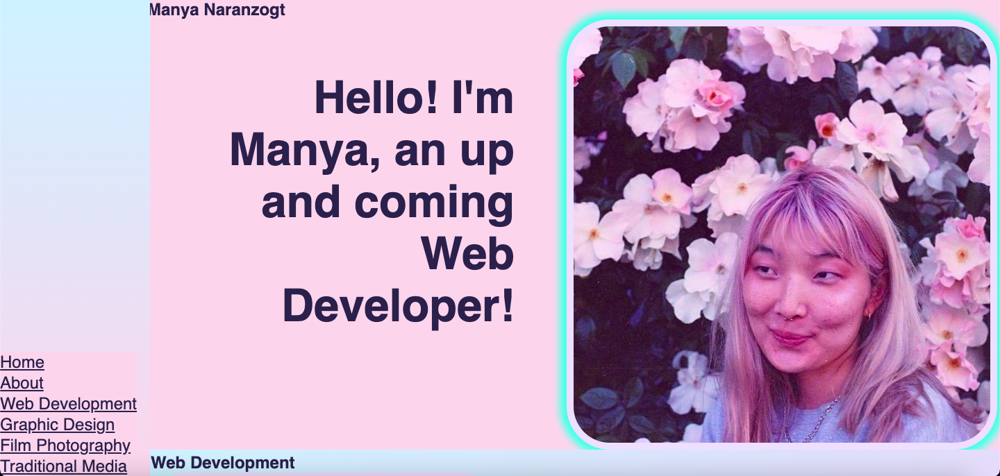

# week2portfoliochallenge
manyanara.github.io/week2portfoliochallenge

## Description

Provide a short description explaining the what, why, and how of your project. Use the following questions as a guide:
This is the first iteration of a portfolio website for my week 2 challenge of my Web Development course. I build all code from scratch with no origin code given. 
I dont like this layout so hopefully in the future my websites will look better.

## Installation

To view my project go to:
manyanara.github.io/week2portfoliochallenge
in your web browser.

## Usage

You can navigate to different sections of the page in the navigation bar to the left. At the moment only filler text is provided as I don't have many projects to display.

## Credits

While I did use Google and Youtube to troubleshoot any issues and questions I had, all code is original and written by me. 

## How to Contribute

If you created an application or package and would like other developers to contribute to it, you can include guidelines for how to do so. The [Contributor Covenant](https://www.contributor-covenant.org/) is an industry standard, but you can always write your own if you'd prefer.

The website should look like: 
